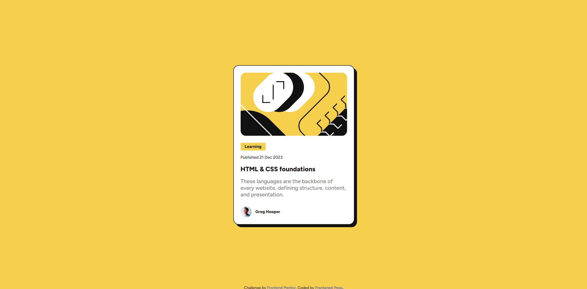
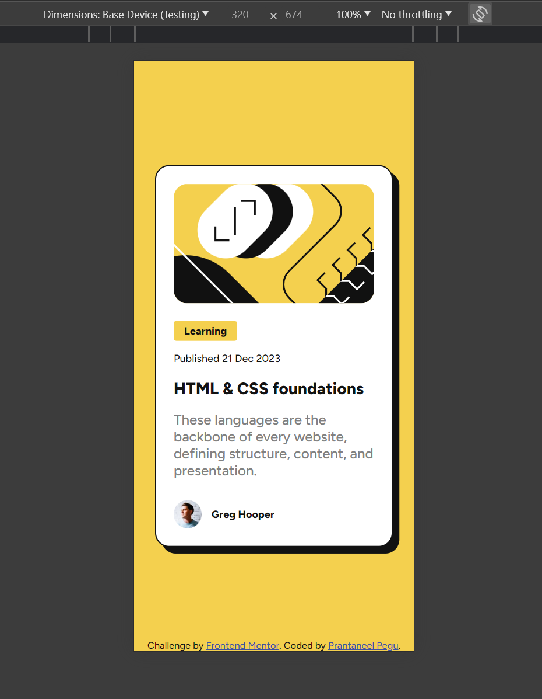

# Frontend Mentor - Blog preview card solution

This is a solution to the [Blog preview card challenge on Frontend Mentor](https://www.frontendmentor.io/challenges/blog-preview-card-ckPaj01IcS). 

## Table of contents

- [Overview](#overview)
  - [The challenge](#the-challenge)
  - [Screenshot](#screenshot)
  - [Links](#links)
- [My process](#my-process)
  - [Built with](#built-with)
  - [What I learned](#what-i-learned)
- [Author](#author)

## Overview

### The challenge

Users should be able to:

- See hover and focus states for all interactive elements on the page

### Screenshot

Test on Desktop


Test on Mobile



Test on Mobile (landscape mode)


### Links

- Solution URL: [link](https://github.com/Prantaneel-Pegu/Frontend_Mentor/tree/c82551ec9e9c6d9f215e98ecbfee5b1fdce8c536/Blog%20Preview%20Card)
- Live Site URL: [link](https://prantaneel-pegu.github.io/Frontend_Mentor/Blog%20Preview%20Card/)

## My process

### Built with

- Semantic HTML5 markup
- CSS custom properties
- Flexbox
- Mobile-first workflow

### What I learned

If we specify a width and height on an image which will change its aspect ratio, instead of actually scaling to those dimensions it will
preserve its aspect ratio and set its height to the value we give and the width we give won't matter(It will set its width to conform to
the original aspect ratio).

I solved it by giving the image the property "object-fit: cover" in the CSS. This resulted in the image retaining its aspect ratio and 
cropping to fill the width and height I gave. (I used this while designing for mobile landscape mode, you can check my code in the breakpoints section in the CSS.)


```css
  #card-img{
      width: 100%;
      height: 10em;
      object-fit: cover;
  }  
```

## Author

- Frontend Mentor - [@Prantaneel-Pegu](https://www.frontendmentor.io/profile/Prantaneel-Pegu)
- Twitter - [@PrantaneelPegu](https://twitter.com/PrantaneelPegu)
- Github - [Prantaneel-Pegu](https://github.com/Prantaneel-Pegu/Frontend_Mentor)
- LinkedIn - [Prantaneel Pegu](https://www.linkedin.com/in/prantaneel-pegu/)


