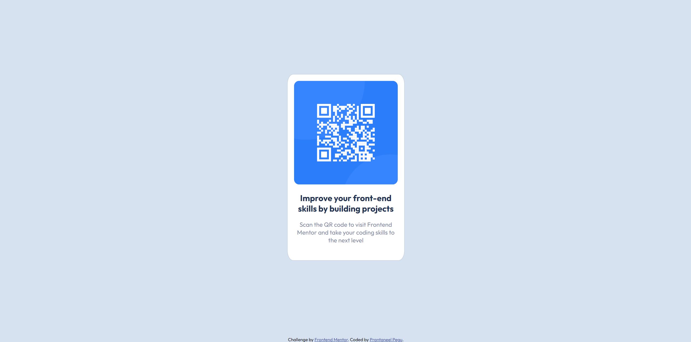
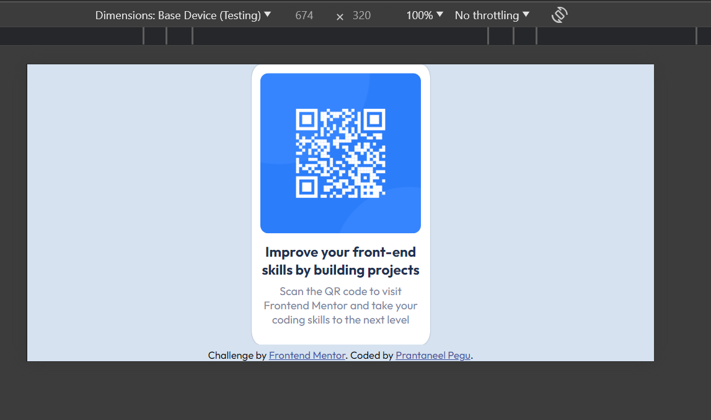

# Frontend Mentor - My QR code component solution

## Table of contents

- [Overview](#overview)
  - [Screenshot](#screenshot)
  - [Solution Links](#links)
- [My process](#my-process)
  - [Built with](#built-with)
  - [What I learned](#what-i-learned)
  - [Continued development](#continued-development)
  - [Useful resources](#useful-resources)
- [Author](#author)

## Overview

### Screenshots


    Test: Desktop



    Test: Mobile landscape mode

### Links

- Solution URL: [link](https://github.com/Prantaneel-Pegu/Frontend_Mentor/tree/main/QR%20Code%20Component)
- Live Site URL: [link](https://prantaneel-pegu.github.io/Frontend_Mentor/QR%20Code%20Component/)

## My process

### Built with

- Semantic HTML5 markup
- CSS custom properties
- Flexbox
- Mobile-first workflow

### What I learned

1. Had some problems with centering an absolute positioned div on both axes, refreshed up on transform: translate(x,y) to solve it.

```html
<div class='center-me'>I am centered!</div>
```
```css
.center-me {
    position: absolute;
    top: 50%;
    left: 50%;
    transform: translate(-50%, -50%);
}
```

### Continued development

I plan to learn markdown. I see it quite often.

### Useful resources

- [CSS Transforms](https://youtu.be/rzD-cPhq02E?feature=shared) - This is a great video on CSS transforms by WebDev Simplified.

## Author

- Frontend Mentor - [@Prantaneel-Pegu](https://www.frontendmentor.io/profile/Prantaneel-Pegu)
- Twitter - [@PrantaneelPegu](https://twitter.com/PrantaneelPegu)
- Github - [Prantaneel-Pegu](https://github.com/Prantaneel-Pegu/Frontend_Mentor)
- LinkedIn - [Prantaneel Pegu](https://www.linkedin.com/in/prantaneel-pegu/)